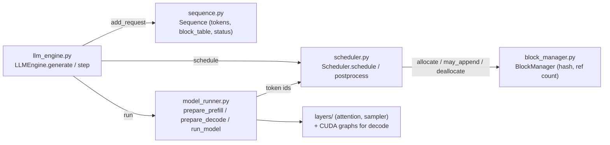

# P6.1: Reading nano-vllm

| | |
|---|---|
| **Tier** |  for reading and the mapping table.  for exercise 2 (timing nano-vllm on a real model) |
| **Time** | ≈30 min reading + ≈6 h hands-on |
| **Prerequisites** | P2.3 (continuous batching, PagedAttention as a user), P0.5 (#0 v0, the CPU engine), P5.8 (paged decode attention) |
| **You will build** | an annotated map from every nano-vllm function to its counterpart in **#0 v1** (`platform/engine/v1`), vLLM v1 and SGLang |

## Learning objectives

1. Trace one request from `LLM.generate()` to its last token through nano-vllm's five core files.
2. Name the three decisions an engine makes every step (what to compute, where its KV lives, which token comes next) and the file that owns each.
3. Map each nano-vllm component to vLLM v1 and SGLang, at the pinned versions.
4. Explain where time goes in one engine step, and why CPU-side scheduling cost matters at small batch.

---

## 1. Why nano-vllm

nano-vllm (pinned `bb823b3e`, MIT) is a complete vLLM-style engine — continuous batching, paged KV with prefix caching, tensor parallelism, CUDA graphs — in roughly a thousand lines of Python. It is small enough to read in an afternoon and faithful enough that every concept maps onto vLLM. We read it, then rebuild each piece in **#0 v1** with tests (P6.2–P6.6), then compare against the production code.

> Licence note: nano-vllm is MIT, vLLM and SGLang are Apache-2.0. Quote **≤ 15 lines** at a time, with the file path and the pinned SHA, and annotate rather than copy.

## 2. One request, five files



The step loop is the same in every engine you'll read, including ours (`platform/engine/v1/s2s_engine/engine.py`):

```
out    = scheduler.step()          # WHAT to compute this step (P6.2), WHERE its KV lives (P6.3)
logits = runner.execute(out)       # one forward pass over every scheduled token (P6.6, P5 kernels)
tokens = sample(logits)            # WHICH token comes next (P6.5)
scheduler.update(out, tokens)      # append, finish, free
```

## 3. The mapping

Paths are at the pinned versions (nano-vllm `bb823b3e`, vLLM `v0.31.0`, SGLang `v0.5.21`); **re-verify each path at the pin before you rely on it** — files move between releases (UNVERIFIED until you check).

| Concern | nano-vllm | #0 v1 (this repo) | vLLM v1 | SGLang |
|---|---|---|---|---|
| request state | `engine/sequence.py` `Sequence` | `s2s_engine/sequence.py` `Sequence` | `vllm/v1/request.py` `Request` | `srt/managers/schedule_batch.py` `Req` |
| step loop | `engine/llm_engine.py` `step` | `engine.py` `LLMEngine.step` | `vllm/v1/engine/core.py` `EngineCore.step` | `srt/managers/scheduler.py` event loop |
| scheduling | `engine/scheduler.py` | `scheduler.py` | `vllm/v1/core/sched/scheduler.py` | `srt/managers/scheduler.py` + `schedule_policy.py` |
| KV blocks + prefix hashing | `engine/block_manager.py` | `block_manager.py` | `vllm/v1/core/kv_cache_manager.py`, `block_pool.py` | — (token-level radix instead) |
| radix prefix cache | — | `radix_cache.py` | — | `srt/mem_cache/radix_cache.py` |
| forward pass + inputs | `engine/model_runner.py` | `model_runner.py` | `vllm/v1/worker/gpu_model_runner.py` | `srt/model_executor/model_runner.py` |
| CUDA graphs | `model_runner.py` `capture_cudagraph` | `cuda_graph.py` | `vllm/compilation/cuda_graph.py`, `docs/design/cuda_graphs.md` | `srt/model_executor/cuda_graph_runner.py` |
| sampling | `layers/sampler.py` | `sampling.py` | `vllm/v1/sample/sampler.py` | `srt/layers/sampler.py` |
| spec-decode verify | — | `spec_verify.py` | `vllm/v1/sample/rejection_sampler.py`, `vllm/v1/spec_decode/` | `srt/speculative/` |
| HTTP API | — (offline only) | `server.py` | `vllm/entrypoints/openai/` | `srt/entrypoints/http_server.py` |

## 4. Reading guide

Read in this order, and answer each question in your notes before moving on:

1. **`sequence.py`** — which fields change every step? Which only on preemption? (Compare our `num_computed`: it is what makes chunked prefill and prefix hits the *same* mechanism.)
2. **`block_manager.py`** — how is a block's hash computed, and why is it *chained* on the previous block's hash? What happens to a block's hash when its ref count hits zero?
3. **`scheduler.py`** — prefill and decode are scheduled in **separate** steps in nano-vllm. vLLM v1 mixes them in one budget. Find the line that makes that choice (this is exercise 3's starting point).
4. **`model_runner.py`** — `prepare_prefill` builds `cu_seqlens` and a `slot_mapping`; `prepare_decode` builds `context_lens` and `block_tables`. Which of these are padded for CUDA graphs and why?
5. **`llm_engine.py`** — where does the tokenizer run, and where would async scheduling (overlapping CPU scheduling with GPU compute) go?

## Walkthrough

```bash
# T0: our engine, fake model — every concept of this phase, no GPU
uv run python course/P6-engine-internals/P6.1-reading-nano-vllm/examples/01_trace_one_step.py
uv run pytest platform/engine/v1/tests -q
```

## What you should see

`01_trace_one_step.py` prints, for each step, the scheduled chunks (sequence, start position, tokens), the blocks allocated, any preemptions, and the sampled tokens, ending with `all 3 requests finished in N steps`.

## Exercises

| # | Exercise | Tier | Check |
|---|---|---|---|
| 1 | [Concept-mapping table](exercises/01-mapping.md) | T0 | reviewed against the quiz |
| 2 | [Where does a step's time go? Instrument nano-vllm](exercises/02-timers.md) | T2 | your table + `aws.md` |
| 3 | *(hard)* [One behavioural difference between nano-vllm's and vLLM's scheduler, reproduced with a trace](exercises/03-difference.md) | T0/T2 | your trace |

## Common mistakes

- Reading the model code first. The engine logic is in the scheduler and block manager; the model is "just" a function from (tokens, positions, slots) to logits.
- Treating `num_computed` (or vLLM's `num_computed_tokens`) as "prompt length". After a prefix-cache hit it starts *above* zero; after a preemption by recompute it goes *back* to zero.
- Quoting whole files from nano-vllm or vLLM into your notes repo. Annotate short excerpts.

## Go deeper

- nano-vllm README and source (pinned SHA).
- vLLM v1 design docs in `docs/design/` (scheduler, prefix caching, CUDA graphs) at `v0.31.0`.
- SGLang paper (arXiv 2312.07104) for the radix-cache side.

**Next:** [P6.2 Scheduler](../P6.2-scheduler/README.md).
