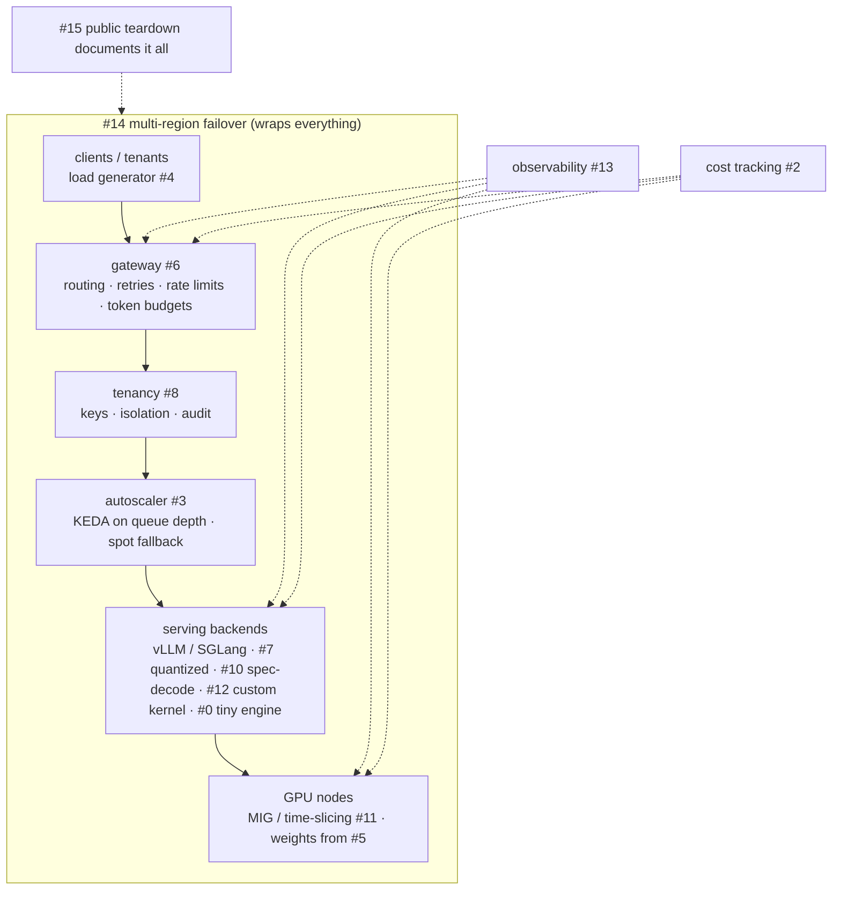

# platform/ — the portfolio repo

Every project in the course is a layer of **one** platform. This folder is its skeleton. Each layer is filled in as the course reaches its project, and the folder can later be split out into its own repository.

| Path | Project | Phase | Tier |
|---|---|---|---|
| `tools/capacity/` | D3 capacity calculator | P1 | T0 |
| `loadgen/` | #4 continuous-batching load test | P2 | T0/T2 |
| `bakeoff/` | #7 quantized serving bakeoff | P2 | T2 |
| `specdec/` | #10 speculative decoding prototype | P2 | T2 |
| `gateway/` | #6 multi-model AI gateway | P2 | T0 |
| `deploy/` | #1 self-hosted inference cluster (Helm/Kustomize) | P3 | T3 |
| `observability/` | #13 observability spine | P3 | T0/T3 |
| `cost/` | #2 cost-per-token dashboard | P3 | T0/T3 |
| `autoscaler/` | #3 queue-based GPU autoscaler | P3 | T3 |
| `weights/` | #5 model weight delivery | P3 | T2/T3 |
| `tenancy/` | #8 secure multi-tenant layer | P3 | T0/T3 |
| `training/` | #9 checkpointed distributed training | P4 | T3 |
| `partitioning/` | #11 GPU partitioning lab | P4 | T3 |
| `kernels/` | D4 kernels repo; #12 custom kernel path | P5 | T2 |
| `engine/` | #0 v0 (CPU, P0) → #0 v1 (GPU, P6) | P0/P6 | T0/T2 |
| `failover/` | #14 multi-region failover drill | Cap | T3 |
| `report/` | #15 public benchmark teardown | Cap | — |

The P0 drills D1 (SIMD SGEMM) and D2 (KV block allocator) live in their modules, `course/P0-systems-primer/P0.4…` and `…/P0.3…`. D2 grows into `engine/` in P6.3.
